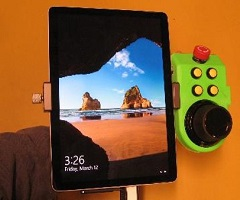
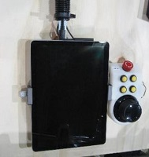
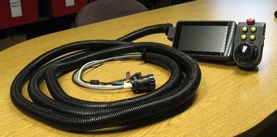
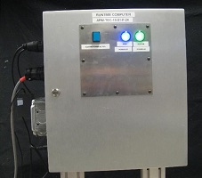

# PyRI Open Source Teach Pendant Device

   

**WARNING: THIS IS AN INCOMPLETE DESIGN. USE AT OWN RISK!**

Bill of Materials:

| Description | Supplier | Part Number | Quantity |
| ---         | ---      | ---         | ---      |
| E-Stop      | Mouser   | 123-51-256.025 | 1        |
| Enabling Switch | Newark | 84C2723 | 1 |
| Pushbutton  | Mouser   |
| 

## Acknowledgment

This work was supported in part by Subaward No. ARM-TEC-19-01-F-24 from the Advanced Robotics for Manufacturing ("ARM") Institute under Agreement Number W911NF-17-3-0004 sponsored by the Office of the Secretary of Defense. ARM Project Management was provided by Christopher Adams. The views and conclusions contained in this document are those of the authors and should not be interpreted as representing the official policies, either expressed or implied, of either ARM or the Office of the Secretary of Defense of the U.S. Government. The U.S. Government is authorized to reproduce and distribute reprints for Government purposes, notwithstanding any copyright notation herein.

This work was supported in part by the New York State Empire State Development Division of Science, Technology and Innovation (NYSTAR) under contract C160142. 

 

PyRI is developed by Rensselaer Polytechnic Institute, Wason Technology, LLC, and contributors.